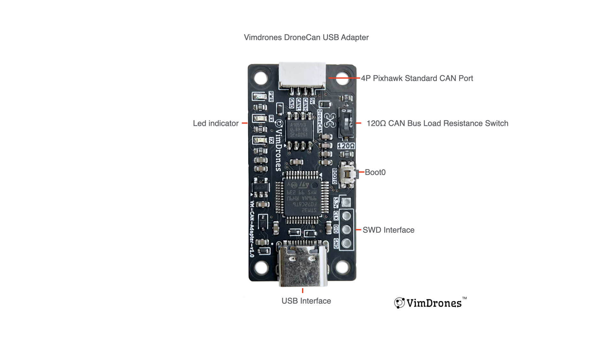

# MAVCAN_Bridge

A high-performance USB to CAN bus adapter with MAVLink protocol support.

## Overview

MAVCAN_Bridge is an interface device that bridges USB and CAN bus communications with support for the MAVLink protocol. It enables computers to communicate with CAN bus devices (like drone flight controllers, motor controllers, and sensors) over a standard USB connection.
MacOS, Windows, Linux is both supported

## Supported Dronecan Software 
- [Dronecan Web Tool](https://can.vimdrones.com)
- [Dronecan GUI Tool](https://dronecan.github.io/GUI_Tool/Overview/)
- [[pydronecan bridge](https://github.com/dronecan/pydronecan/blob/master/tools/dronecan_bridge.py)]

## Supported Hardware
- [Vimdrones DroneCAN Adapter](https://dev.vimdrones.com/products/vimdrones_can_adapter)  


## DFU Update for Existing Hardware
To update the DroneCAN Adapter firmware, press the boot button and plug in the USB cable to enter DFU mode.

- Using the web DFU tool: [Web DFU](https://devanlai.github.io/webdfu/dfu-util) with `MAVCAN_Bridge.bin`.
- Using the command-line tool:
```bash
#macos
brew install dfu-util

#linux
sudo apt-get install dfu-util

#common
dfu-util -l
dfu-util -a 0 -s 0x08000000:leave -D build/MAVCAN_Bridge.bin
```

## Pydronecan Bridge Example
```bash
dronecan_bridge.py mavcan:/dev/tty.usbmodem2061375D52461 mcast:0
```

## Building the Project
```bash
git clone https://github.com/vimdrones/MAVCAN_Bridge.git
cd MAVCAN_Bridge
git submodule update --init --recursive
mkdir build
cd build
cmake ..
make
```